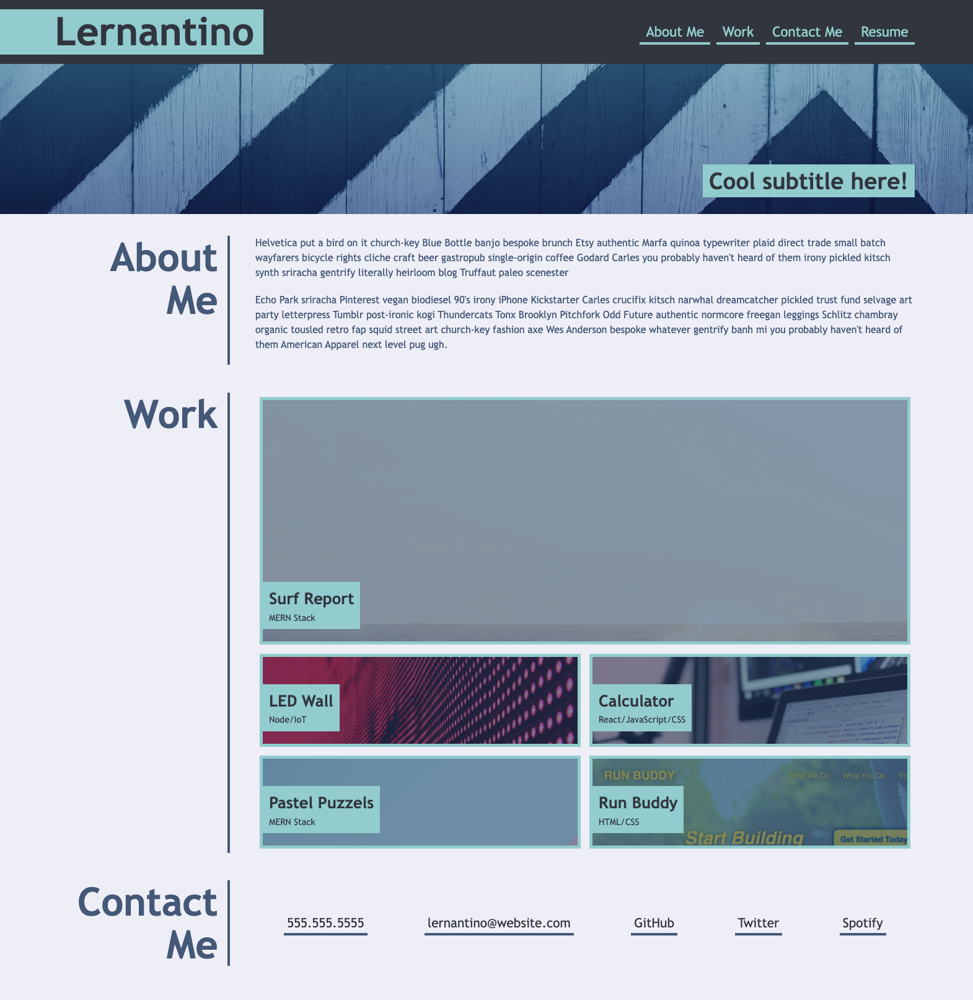
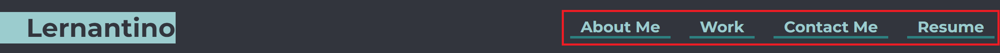
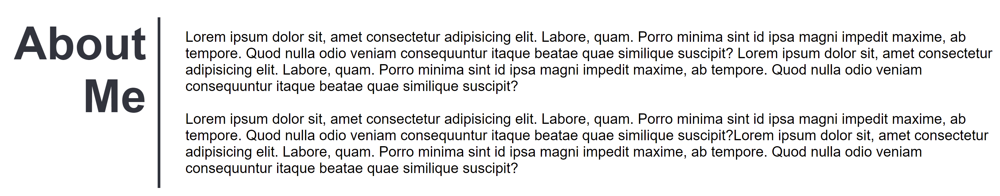
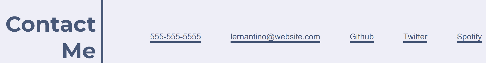

# module-2-challenge
## View this project hosted by/on GitHub Pages: [Module 2 Challenge Website](https://dusticcus.github.io/module-2-challenge/ "Hosted Website")

This project was built as a learning task, in how to recreate a website (pictured below) with HTML and CSS from a photo reference.

The website built is a generic work portfolio for showcasing information about a developer, as well as complete projects/work and provide their contact information.

## Technologies Used:
- HTML
- CSS

### Website Sections and general information:
1. Navigation: Use the links in the red highlight box to move around the page sections.

2. Sections:

    1. About Me: Write something about yourself.
    

    2. Work: Add Images and links to your work.
    

    3. Contact: Add your contact info.
    
